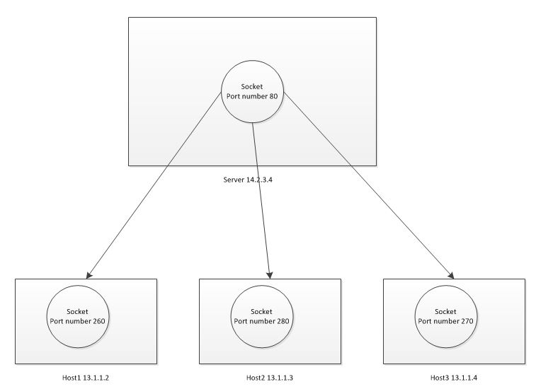

# Network Programming

## Concepts

### TCP/IP Ports

On a TCP/IP network every device must have an IP address.

Just as the IP address identifies the computer, the network **port** identifies the **application or service** running on the computer.

> The use of **ports allow computers/devices to run multiple services/applications**.

### TCP Sockets

**Sockets** are the main components that allow us to exploit the capabilities of the operating system to interact with the network.

A **socket** is one endpoint of a two-way communication link between two programs (**process**) running on the network. A socket is **bound to a port number** so that the **TCP layer** can identify the application that data is destined to be sent to.

> #### `IP Address + Port number = Socket` (socket address)

#### Client-server Architecture

A central server provides services to a set of machines that connect to it.

**One socket on a host binds to an IP and a unique port number for each connection.**



#### Concurrency

> A **socket** is *identified* by a **`local address + remote address`** (**socket pair** tuple).
>
A server may create several **concurrently established TCP sockets** with the same **local port number** and **local IP address**, each mapped to its own server-child process, serving its own client process. They are treated as different sockets by the operating system since the **remote socket address** (the **client IP address** and **client port number**) is different.

While the original socket continues to listen for incoming connections (status: LISTEN), a new socket with same local address is created to communicate with each accepted connection (status: ESTABLISHED).

### "Client" socket vs. "server" socket

* **“client” socket** - an endpoint of a conversation. (ESTABLISHED)

* **“server” socket** - more like a switchboard operator. (LISTEN)

* The **client application** (your browser, for example) **uses “client” sockets exclusively**.
  * It will be implemented as a Python **`socket` client** that `connect`s to a remote host, `send`s it a request or command and `recv`s the response data.

* The **web server** it’s talking to **uses both “server” sockets and “client” sockets**.

  * It will be implemented as a Python **`socket` server** that starts a web server process at a local address to `listen` for incoming connections and create unique, dedicated sockets to handle them in 1. A new child process or 2. A new processing thread.

* **local address**: for both "server" and "client" sockets refers to **whatever is listening** for connections on your machine (**loopback interface** web server (`127.0.0.1:xxxx`, `0.0.0.0:xxxx`) or **internal ip** (`192.168.x.xxx:xxxxx`))

* **remote address**: "server" sockets don't have a remote address because they don't establish the connection, "client" sockets do and their remote address is the **connected client's address** (ex. a browser: `172.217.6.196:80`).

## Sockets in Python

Python's `socket` module provides an interface to the Berkeley sockets API.

It exposes all of the necessary methods to quickly write TCP and UDP clients and servers for writing low-level network applications. There are higher-level Python APIs such as `Twisted` that might be better suited.

Things well need:

```python
from socket import (AF_INET, SO_REUSEPORT, SOCK_STREAM, SOL_SOCKET,
                    create_server, socket)
```

### Creating a Socket

A server *must* perform the sequence

1. [**`socket()`**](#socket())
2. [**`bind()`**](#bind())
3. **`listen()`**
4. [**`accept()`**](#accept()) (possibly repeating the `accept()` to service more than one client)

While a client only needs the sequence

1. [**`socket()`**](#socket())
2. [**`connect()`**](#connect()) or [**`connect_ex()`**](#connect_ex())

#### Server application socket

Status | Local Address (`laddr`) | Remote Address (`raddr`) |
--- | --- | --- |
Before `bind` | zero (`0.0.0.0:0`), no connection | N/A
After `bind` | ex. `0.0.0.0:8080` (everyone) <br> ex2. `127.0.0.1:8080` (localhost) <ul><li><b>ip</b>: your web server's ip</li><li><b>port</b>: your web server's port</li></ul>A TCP server (such as a web server process) <b><i>listens</b></i> on a local port. Here, the local address only controls who can connect to this port: everyone, or only connections from localhost. | N/A
After `listen` | No change | N/A
After `accept` | No change <br><br> `accept` returns a new socket to handle the connection while this one just keeps on listening | N/A

#### Client application socket

Status | Local Address (`laddr`) | Remote Address (`raddr`) |
--- | --- | --- |
Before `connnect` | zero (`0.0.0.0:0`), no connection | N/A
After `connect` | ex. `192.168.1.246:50679`<ul><li><b>ip</b>: internal ip of your machine</li><li><b>port</b>: dynamically assigned</li></ul> | ex.`142.250.64.68:80` <ul><li><b>ip</b>: ip of the client's web server</li><li><b>port</b>: port the client's web server is listening on (`80` for http is normal)</li></ul>

### Implementation

### socket()

**server** and **client app socket** method (used the same for both)

```python
socket(family=AF_INET, type=SOCK_STREAM, proto: int=0) -> socket
socket(family=-1, type=-1, proto=-1, fileno: int=None) -> socket
"""Open a socket of the given type.

:param family: socket domains defined on AddressFamily
:param type: socket types defined on SocketKind. Stream (SOCK_STREAM) or datagram (SOCK_DGRAM) socket.
:param proto: protocol
:param fileno: when passed, family, type and proto are auto-detected, unless they are explicitly set.
:return: one endpoint of a network connection
"""
```

### connect()

**client app socket** method

```python
connect(addr: tuple[str, int]) -> None
"""Connects the client to the server IP address.

:param addr: A pair (host, port) is used for the AF_INET address family,
             where host is a string representing either a hostname in
             Internet domain notation like 'daring.cwi.nl' or an IPv4
             address like '100.50.2005', and port is an integer.
"""
```

Roughly speaking, when you visit the webpage www.python.org, your browser does something like the following (**client socket**):

```python
# create an INET, STREAMing socket
s = socket()
# <socket.socket fd=3, family=AddressFamily.AF_INET, type=SocketKind.SOCK_STREAM, proto=0, laddr=('0.0.0.0', 0)>
print(repr(s))
# now connect to the web server on port 80 - the normal http port
s.connect(("www.python.org", 80))
# <socket.socket ...laddr=('192.168.1.246', 50679), raddr=('142.250.64.68', 80)>
print(repr(s))
```

### connect_ex()

**client app socket** method

```python
connect_ex(addr: tuple[str, int]) -> int
"""
Same functionality as the connect() method and also offers the possibility
of returning an error in the event of not being able to connect with that
address.
"""
```

Say our socket client we try to 

```python
s = socket()
# <socket.socket fd=3, family=AddressFamily.AF_INET, type=SocketKind.SOCK_STREAM, proto=0, laddr=('0.0.0.0', 0)>
print(repr(s))
# now connect to the web server on port 80 - the normal http port
s.connect(("www.python.org", 80))
# <socket.socket ...laddr=('192.168.1.246', 50679), raddr=('142.250.64.68', 80)>
print(repr(s))
```

### accept()

```python
accept() -> tuple
"""Accept connection, returning new socket fd and client address.

Enables us to accept client connections and returns a tuple with
two values that represent client_socket and client_address. You
need to call the socket.bind() and socket.listen() methods
before using this method.

"""
```

### bind()

```python
bind(addr: tuple[str, int])
"""Bind the socket to a local address.

With the requirement that the socket must be open before establishing the connection with the address.
"""
```

### listen()

```python
listen(backlogs: )
"""Bind the socket to a local address.

With the requirement that the socket must be open before establishing the connection with the address.
"""
```

## Using a Socket

These are the general socket methods we can use in both clients and servers:

**TCP communication**:

* [**`send()`**](#send())
* [**`recv()`**](#recv())

**UDP communication**:

* **`sendto(data, addr)`**: Sends data to a given address.
* **`recvfrom(bufsize)`**: This method receives data and the sender's address.

### recv()

```python
recv(bufsize: int) -> bytes
"""Receive data from the socket.

It is a blocking call - blocking if no data is waiting to be read.

:param bufsize: the maximum amount of data it can receive.
:return: bytes object representing the data received.
"""
```

* Ex. `s.recv(1024)` will read at most 1024 bytes.

* Note: for best match with hardware and network realities, the value of `bufsize` should be relatively small (commonly, power of 2), for example, 4096.

### send()

```python
send(data: bytes) -> bytes
"""Sends bytes of data to the specified target."""
```

### Basic client with the `socket` module

Once the connection is established, we can send and receive data using:

## Organize

For example: here I've started a `python3 -m http.server` on localhost port 7001:

```bash
Proto Local Address   Foreign Address  (state)       COMMAND
tcp4  127.0.0.1:7001          LISTEN        32143/python3
```

When the server process `accept`s the connection we get a socket representing that connection (**a unique file descriptor**).

I connect to that web server via my web browser, and we see two additional sockets:

```bash
Proto Local Address   Foreign Address  (state)      COMMAND
tcp4  127.0.0.1:7001   0.0.0.0:*        LISTEN       32143/python3
tcp4  127.0.0.1:50204  127.0.0.1:7001   ESTABLISHED  1658/firefox
tcp4  127.0.0.1:7001   127.0.0.1:50204  ESTABLISHED  32143/python3
```

(data obtained via `netstat`, and edited for clarity. Also check out `lsof -i`)

The Firefox browser created a socket to `connect()` to the server. Firefox uses port 50204 in this case, so its socket is identified as local `127.0.0.1:50204 remote 127.0.0.1:7001`. When the server `accept()`ed the connection, this connection got its own socket, which is basically the reverse of the client socket: `local 127.0.0.1:7001 remote 127.0.0.1:50204`. The local port is the same port the server is listening to.
