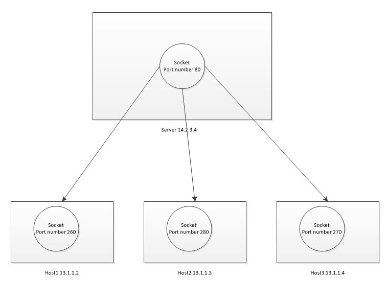

# Network Programming

## Concepts

### Sockets

**Sockets** are the main components that allow us to exploit the capabilities of the operating system to interact with the network.

A **network socket** is an end point of a connection for a **process**. **1 socket on a host binds to an IP and a unique port number for each connection.**



A **socket address** for a network consists of an IP address and port number.

A socket is identified by a **local address + a remote address**.

Hence, a server may create several concurrently established TCP sockets with the same **local port number** and **local IP address**, each mapped to its own server-child process, serving its own client process. They are treated as different sockets by the operating system since the **remote socket address** (the client IP address or port number) is different; i.e. since they have different **socket pair** tuples.

### "Client" socket vs. "server" socket

* **“client” socket** - an endpoint of a conversation.

* **“server” socket** - more like a switchboard operator.

* The **client application** (your browser, for example) **uses “client” sockets exclusively**.

* The **web server** it’s talking to **uses both “server” sockets and “client” sockets**.

## Sockets in Python

Python's `socket` module provides an interface to the Berkeley sockets API.

It exposes all of the necessary methods to quickly write TCP and UDP clients and servers for writing low-level network applications. There are higher-level Python APIs such as `Twisted` that might be better suited.

Things well need:

```python
from socket import (AF_INET, SO_REUSEPORT, SOCK_STREAM, SOL_SOCKET,
                    create_server, socket)
```

### Creating a Socket


In a **client-server architecture**, there is a central server that provides services to a set of machines that connect to it.

A server *must* perform the sequence

1. [**`socket()`**](#socket())
2. **`bind()`**
3. **`listen()`**
4. **`accept()`** (possibly repeating the `accept()` to service more than one client)

While a client only needs the sequence

1. [**`socket()`**](#socket())
2. [**`connect()`**](#connect())

### Implementation

### socket()

```python
socket(family=AF_INET, type=SOCK_STREAM, proto=0) -> socket
"""
:param family: socket domains defined on AddressFamily
:param type: socket types defined on SocketKind
:param proto: int
"""
```

### connect()

```python
connect(address: tuple[str, int])
"""
:param address: A pair (host, port) is used for the AF_INET
    address family, where host is a string representing
    either a hostname in Internet domain notation like
    'daring.cwi.nl' or an IPv4 address like '100.50.200
    5', and port is an integer.
"""
```

Roughly speaking, when you visit the webpage www.python.org, your browser does something like the following (**client socket**):

```python
# create an INET, STREAMing socket
s = socket()
# <socket.socket fd=3, family=AddressFamily.AF_INET, type=SocketKind.SOCK_STREAM, proto=0, laddr=('0.0.0.0', 0)>
print(repr(s))
# now connect to the web server on port 80 - the normal http port
s.connect(("www.python.org", 80))
# <socket.socket ...laddr=('192.168.1.246', 50679), raddr=('142.250.64.68', 80)>
print(repr(s))
```

Note: of the socket after it `connect`s,

* The local ip address is the internal ip of your machine
* The local port is dynamically assigned
* The remote ip address is the ip address of the client's web server
* The remote host is the port the server is listening on

## Using a Socket

### Basic client with the `socket` module

Once the connection is established, we can send and receive data using:

**TCP communication**:

* **`send()`**
* [**`recv()`**](#recv())

**UDP communication**:

* **`sendto()`**
* **`recvfrom()`**

### recv()

```python
recv(bufsize: int) -> bytes
"""Receive data from the socket.

It is a blocking call - blocking if no data is waiting to be read.

:param bufsize: the maximum size it will read
:return: bytes object representing the data received.
"""
```

* Ex. `s.recv(1024)` will read at most 1024 bytes.

* Note: for best match with hardware and network realities, the value of `bufsize` should be relatively small (commonly, power of 2), for example, 4096.

## Organize

A TCP server (such as a web server process) *listens* on a local port. Here, the local address only controls who can connect to this port: everyone, or only connections from localhost.

The remote address of a listening socket is zero, which means no connection.

For example: here I've started a `python3 -m http.server` on localhost port 7001:

```bash
proto Local Address   Foreign Address  (state)
tcp  127.0.0.1:7001   0.0.0.0:*       LISTEN        32143/python3
```

When the server process `accept`s the connection we get a socket representing that connection (**a unique file descriptor**).

I connect to that web server via my web browser, and we see two additional sockets:

```bash
proto Local Address   Foreign Address  (state)
tcp  127.0.0.1:7001   0.0.0.0:*        LISTEN       32143/python3
tcp  127.0.0.1:50204  127.0.0.1:7001   ESTABLISHED  1658/firefox
tcp  127.0.0.1:7001   127.0.0.1:50204  ESTABLISHED  32143/python3
```

(data obtained via `netstat`, and edited for clarity. Also check out `lsof -i`)

The Firefox browser created a socket to `connect()` to the server. Firefox uses port 50204 in this case, so its socket is identified as local `127.0.0.1:50204 remote 127.0.0.1:7001`. When the server `accept()`ed the connection, this connection got its own socket, which is basically the reverse of the client socket: `local 127.0.0.1:7001 remote 127.0.0.1:50204`. The local port is the same port the server is listening to.
